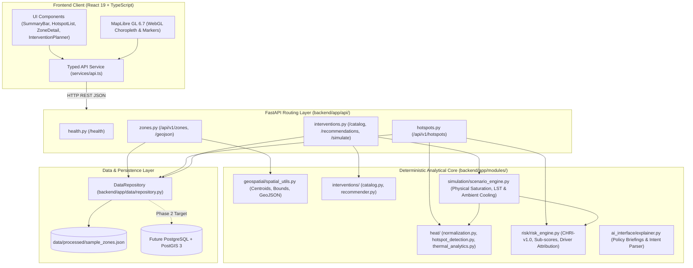

# THERMOS — System Architecture Specification

> **RESONANCE 1.0 — Problem Statement PS13: HeatScape**  
> **Document:** 02-SYSTEM-ARCHITECTURE.md  
> **Status:** Active / Implementation-Grounded

---

## 1. Architectural Style & Design Philosophy

THERMOS is architected as a **modular monolith** with a strict boundary-separated backend and a decoupled single-page React client.

### Design Principles:
1. **Deterministic Analytical Core:** Domain logic resides in pure, stateless Python modules under [backend/app/modules/](../backend/app/modules/). Every calculation is mathematically deterministic, eliminating non-reproducible or probabilistic state changes.
2. **Zero Circular Dependencies:** Domain modules form a strict directed acyclic graph (DAG). The `risk` engine consumes `heat` and `schemas`; `simulation` consumes `interventions`, `risk`, and `heat`; `api` routes import modules, but modules never import routes.
3. **Decoupled AI Translation Layer:** The [ai_interface](../backend/app/modules/ai_interface/) sits at the perimeter as a translator. It converts natural language into structured filters and deterministic outputs into natural language narratives. It has zero mathematical calculation responsibility.
4. **PostGIS-Ready Data Contracts:** Domain entities are defined using strict [Pydantic v2 schemas](../backend/app/schemas/) that mirror relational GIS database columns, allowing seamless transition from in-memory JSON to PostgreSQL/PostGIS.

---

## 2. Layered Architecture Diagram



---

## 3. Module Boundaries and Responsibilities

### 3.1 `backend/app/modules/geospatial`
* **File:** [spatial_utils.py](../backend/app/modules/geospatial/spatial_utils.py)
* **Responsibilities:**
  - Parsing and validating WGS84 (EPSG:4326) coordinates.
  - Computing bounding boxes (`min_lat`, `min_lon`, `max_lat`, `max_lon`) and geometric centroids for urban zone polygons.
  - Formatting spatial data into RFC 7946 GeoJSON `Feature` and `FeatureCollection` structures.
* **Dependencies:** Standard Python math library, [backend/app/schemas/common.py](../backend/app/schemas/common.py).
* **Side Effects:** Pure functional calculations; zero side effects.

### 3.2 `backend/app/modules/heat`
* **Files:**
  - [normalization.py](../backend/app/modules/heat/normalization.py): Standard direct and inverted linear min-max feature normalization clamped to $[0.0, 100.0]$.
  - [hotspot_detection.py](../backend/app/modules/heat/hotspot_detection.py): Centralized dual-criteria hotspot qualification and tier assignment (`CRITICAL`, `SEVERE`, `HIGH`, `MODERATE`).
  - [thermal_analytics.py](../backend/app/modules/heat/thermal_analytics.py): Land Surface Temperature (LST) anomaly extraction and UHI intensity assessment.
* **Dependencies:** [backend/app/schemas/common.py](../backend/app/schemas/common.py), [backend/app/schemas/hotspot.py](../backend/app/schemas/hotspot.py).
* **Side Effects:** None.

### 3.3 `backend/app/modules/risk`
* **File:** [risk_engine.py](../backend/app/modules/risk/risk_engine.py)
* **Responsibilities:**
  - Implements the **Composite Heat Risk Index (CHRI-v1.0)**.
  - Computes the Hazard ($H$), Exposure ($E$), and Vulnerability ($V$) orthogonal component sub-scores.
  - Determines qualitative risk tiers (`LOW`, `MODERATE`, `HIGH`, `SEVERE`, `CRITICAL`).
  - Computes driver percentage attributions that sum strictly to $100\%$.
* **Dependencies:** [backend/app/schemas/risk.py](../backend/app/schemas/risk.py), [backend/app/schemas/zone.py](../backend/app/schemas/zone.py), [normalization.py](../backend/app/modules/heat/normalization.py).
* **Side Effects:** None.

### 3.4 `backend/app/modules/interventions`
* **Files:**
  - [catalog.py](../backend/app/modules/interventions/catalog.py): In-memory authoritative registry of 8 standardized urban cooling interventions (Tree Canopy, Cool Roofs, Permeable Pavements, Transit Shade, Pocket Parks, Green Corridors, Canopy Preservation, Water Retention).
  - [recommender.py](../backend/app/modules/interventions/recommender.py): Rule-based suitability matcher evaluating zone land cover, building footprints, and dominant risk drivers.
* **Dependencies:** [backend/app/schemas/intervention.py](../backend/app/schemas/intervention.py), [backend/app/schemas/zone.py](../backend/app/schemas/zone.py).
* **Side Effects:** None.

### 3.5 `backend/app/modules/simulation`
* **File:** [scenario_engine.py](../backend/app/modules/simulation/scenario_engine.py)
* **Responsibilities:**
  - Enforces physical parcel surface area caps (roof, pavement, street corridor, public space).
  - Computes itemized cooling deltas, diminishing returns damping, and multi-intervention thermal synergy.
  - Evaluates budget ceiling, capital expenditure, and deficit in INR Lakhs (₹).
  - Computes population protected and generates phased implementation roadmaps.
* **Dependencies:** [backend/app/schemas/intervention.py](../backend/app/schemas/intervention.py), [catalog.py](../backend/app/modules/interventions/catalog.py).
* **Side Effects:** None.

### 3.6 `backend/app/modules/ai_interface`
* **File:** [explainer.py](../backend/app/modules/ai_interface/explainer.py)
* **Responsibilities:**
  - Synthesizes clear, executive-level natural-language summaries from computed risk and simulation results.
  - Parses unstructured municipal query text into structured `PlanningConstraints`.
* **Constraint:** Pure consumer of deterministic calculations; never invents numerical figures.

---

## 4. End-to-End Request Lifecycles

### 4.1 Zone Listing & GeoJSON Request Flow
```
User / MapLibre GL
  │
  ├─► GET /api/v1/zones/geojson
  │     │
  │     ▼
  │   zones.py router
  │     │
  │     ├─► DataRepository.get_geojson_feature_collection()
  │     │     └─► reads parsed sample_zones.json
  │     │
  │     └─► Returns GeoJSON FeatureCollection (HTTP 200)
  │
  └─► MapLibre GL renders vector layer choropleth with risk-coded colors
```

### 4.2 Hotspot Ranking & Detail Request Flow
```
User clicks Hotspot tab or Table Row
  │
  ├─► GET /api/v1/hotspots/{zone_id}
  │     │
  │     ▼
  │   hotspots.py router
  │     │
  │     ├─► DataRepository.get_hotspot_detail(zone_id)
  │     │     ├─► risk_engine.compute_heat_risk(zone)
  │     │     ├─► hotspot_detection.classify_hotspot_tier(chri, anomaly)
  │     │     └─► recommender.recommend_interventions_for_zone(zone, risk)
  │     │
  │     └─► Assembles HotspotDetail with audit metadata
  │
  └─► Frontend displays risk dial, driver contribution bars, and recommendations
```

### 4.3 Counterfactual Scenario Simulation Request Flow
```
User adjusts intervention selection and budget in InterventionPlanner UI
  │
  ├─► POST /api/v1/interventions/simulate
  │   Payload: {
  │     "zone_id": "ZONE-01",
  │     "selected_intervention_ids": ["INT-COOL-ROOF", "INT-TREE-CANOPY"],
  │     "budget_inr_lakhs": 25.0
  │   }
  │     │
  │     ▼
  │   interventions.py router
  │     │
  │     ├─► DataRepository.get_zone_by_id(zone_id)
  │     │
  │     ├─► scenario_engine.simulate_scenario(zone, selected_ids, budget_inr_lakhs)
  │     │     ├─► computes physical surface limits (roof, pavement, street_corridor, public_space)
  │     │     ├─► scales effective area to physical availability
  │     │     ├─► calculates capital expenditure and budget utilization in ₹ Lakhs
  │     │     ├─► computes LST cooling delta with multi-intervention damping (ceiling 6.5°C)
  │     │     ├─► computes 2m ambient cooling delta with nature/material synergy (ceiling 2.8°C)
  │     │     ├─► calculates population benefited
  │     │     ├─► groups interventions into phased implementation roadmap
  │     │     └─► attaches DataClassification.SIMULATED and audit assumptions
  │     │
  │     └─► Returns SimulationResponse (HTTP 200)
  │
  └─► Frontend updates temperature gauges, cost badges, budget bar, and phased roadmap
```

---

## 5. Architectural Invariants

The THERMOS codebase enforces the following immutable architectural invariants:
1. **Determinism:** Given identical zone data and intervention inputs, `simulate_scenario` and `compute_heat_risk` produce bitwise-identical results.
2. **Attribution Conservation:** The sum of driver attribution percentages computed by the risk engine equals $100\% \pm 0.5\%$.
3. **Physical Clamping:** No intervention simulation can deploy more surface area than physically exists within the zone for that surface category.
4. **Offline Viability:** The core system functions autonomously without external internet access or live LLM network connections.
