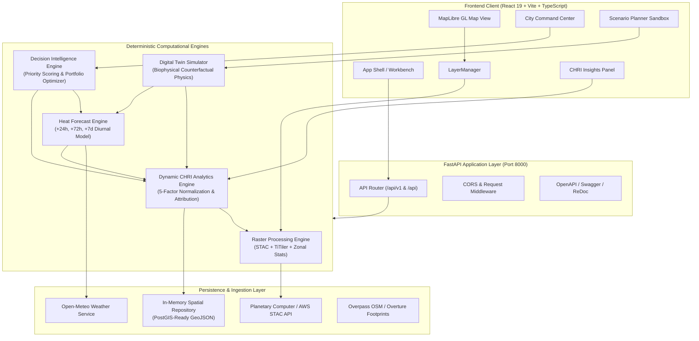
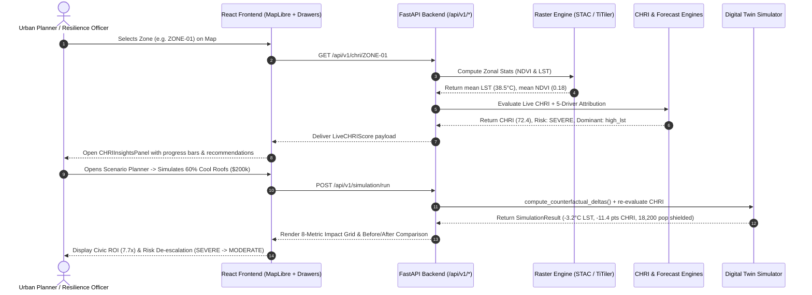
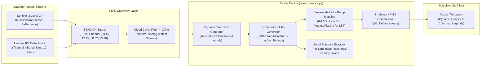
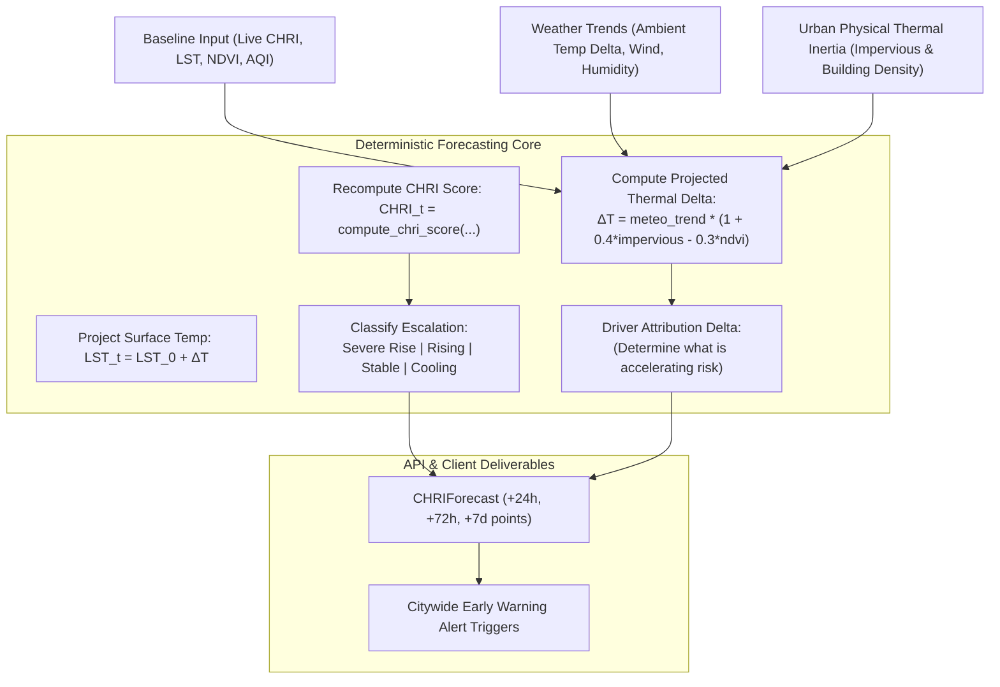
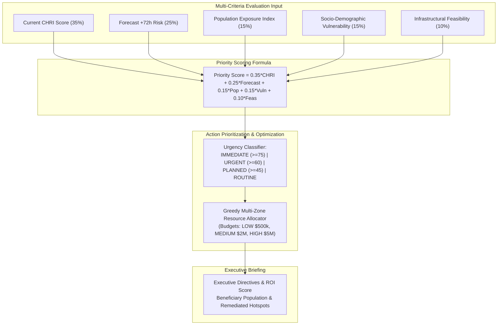
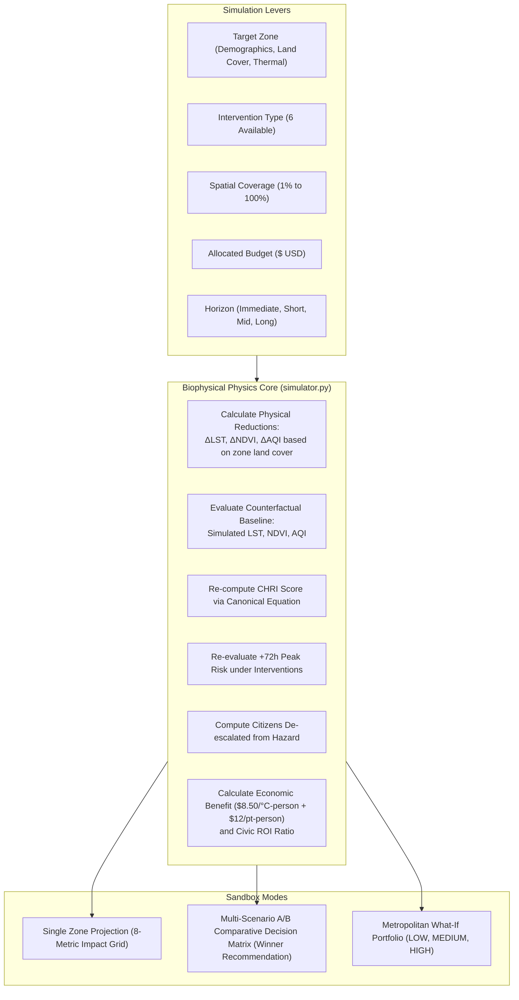

# THERMOS — Architectural Blueprint

**Project:** THERMOS (PS13 — HeatScape: Urban Heat Reduction Planner)  
**System Version:** 2.0.0 (Production Core — Phases 1 through 6)  
**Status:** Approved / Active Specification  

---

## 1. Executive Summary & System Scope

**THERMOS** is an urban climate decision-intelligence and digital twin platform engineered for municipal planners, climate resilience officers, and civic engineers tasked with mitigating Urban Heat Islands (UHI).

Unlike black-box generative AI wrappers, THERMOS is built on **deterministic biophysical physics**, **reproducible geospatial risk algorithms**, **remote sensing raster pipelines**, and **explainable decision-support heuristics**. All computations are transparent, mathematically auditable, and unit-tested.

### Implemented Capability Horizons:
* **Phase 1 — Map Foundation & Real-World Geospatial Layers:** MapLibre GL JS engine, custom `LayerManager`, live Open-Meteo weather integration, animated wind vector particles, Overpass water polygons, and 3D building footprint extrusions.
* **Phase 2 — Remote Sensing Raster Intelligence:** Sentinel-2 multispectral NDVI and Landsat 8/9 thermal LST scene discovery via STAC, dynamic TiTiler integration, server-side raster PNG tile rendering, and zonal statistics extraction.
* **Phase 3 — Dynamic Raster-Driven CHRI Analytics:** Continuous Composite Heat Risk Index (CHRI) evaluation driven by live remote sensing data, 5-driver mathematical decomposition, and interactive visual intelligence drawer.
* **Phase 4 — Predictive Heat Forecasting Engine:** Multi-horizon predictive risk modeling (+24h, +72h, +7d) incorporating meteorological trends, diurnal cycles, and thermal inertia without opaque machine learning dependencies.
* **Phase 5 — Municipal Decision Intelligence:** Citywide executive command center, deterministic priority intervention scoring, municipal action catalogs, and budget-constrained portfolio optimization (LOW, MEDIUM, HIGH tiers).
* **Phase 6 — Urban Climate Digital Twin & Scenario Simulator:** Counterfactual biophysical simulation sandbox, interactive intervention sliders (forestry, cool roofs, reflective pavements, shade corridors, water restoration, AQI zones), side-by-side A/B comparison matrix, and metropolitan what-if forecasting.

---

## 2. High-Level System Architecture

THERMOS adopts a **decoupled modular monolith** architecture on the backend coupled with a **component-driven geospatial frontend**.



---

## 3. Backend Architecture

The backend is written in Python 3.11+ using FastAPI and Pydantic v2. It enforces strict separation of concerns, zero circular imports, and total isolation between API transport, business logic, and spatial data persistence.

```
backend/app/
├── api/                    # HTTP transport layer (FastAPI APIRouters)
│   ├── chri.py             # Zonal CHRI evaluation & driver attribution
│   ├── city.py             # Municipal overview, priority queue, resource portfolios
│   ├── forecast.py         # Multi-horizon heat wave forecasting & early warnings
│   ├── health.py           # Liveness, readiness, and repository inspection
│   ├── hotspots.py         # Thermal anomaly ranking and dossiers
│   ├── interventions.py    # Urban cooling measure catalog
│   ├── raster.py           # TileJSON, PNG raster tiles, colormaps, zonal stats
│   ├── simulation.py       # Digital twin counterfactual sandbox & comparison
│   ├── weather.py          # Ambient meteorological data & heat index
│   └── zones.py            # GeoJSON polygons and zone metadata
├── core/                   # System configuration & environment settings
│   └── config.py           # ThermosSettings Pydantic settings object
├── data/                   # Data access and storage abstractions
│   └── repository.py       # Spatial repository loading sample_zones.json
├── modules/                # Pure business logic and mathematical engines
│   ├── chri/               # CHRI computation, risk tiers, driver attribution
│   ├── city/               # Priority scoring formula & portfolio allocation
│   ├── forecast/           # Diurnal cycle modeling & multi-day heat projections
│   ├── geospatial/         # EPSG:4326 geometries, bbox, centroids, GeoJSON builders
│   ├── heat/               # LST anomaly extraction & thermal severity
│   ├── interventions/      # Cooling suitability & unit cost models
│   ├── raster/             # STAC discovery, TiTiler proxy, PNG tile encoder
│   ├── simulation/         # Deterministic biophysical delta physics & A/B comparison
│   └── weather/            # Open-Meteo client & Steadman heat index calculation
├── schemas/                # Strongly-typed Pydantic domain models & DTOs
└── main.py                 # FastAPI application factory, router mounting, discovery
```

### Architectural Principles:
1. **Dual Route Mounting:** All API routers are mounted under both `/api/v1/*` and `/api/*` to guarantee strict backward compatibility with early client integrations.
2. **Deterministic Computation:** Analytical functions never call random generators, external AI models, or heuristic non-deterministic branches during calculation.
3. **Pydantic Validation:** All incoming query parameters, path variables, and JSON payloads are strictly validated against Pydantic models with field constraints (e.g. `coverage_pct` bounded $[1.0, 100.0]$).

---

## 4. Frontend Architecture

The frontend is built with **React 19**, **TypeScript**, and **Vite**, prioritizing rendering performance, crisp geospatial visualization, and executive usability.

```
frontend/src/
├── components/
│   ├── analytics/
│   │   ├── CHRIInsightsPanel.tsx   # Zone analytical drawer (CHRI score, progress bars, recommendations)
│   │   ├── CityCommandCenter.tsx   # Municipal command modal (KPIs, priority queue, budget tiers)
│   │   ├── ForecastPanel.tsx       # Heat forecast chart (+24h, +72h, +7d escalation badges)
│   │   └── ScenarioPlanner.tsx     # Digital twin sandbox (3 tabs: simulator, A/B matrix, what-if)
│   ├── map/
│   │   ├── LayerControl.tsx        # UI toggle and opacity slider control panel
│   │   └── ThermosMap.tsx          # MapLibre GL map container, camera management, layer hooks
│   ├── weather/
│   │   └── WeatherWidget.tsx       # Real-time meteorological pill with auto-refresh
│   ├── Header.tsx                  # App bar, branding, command/scenario triggers, status pill
│   ├── HotspotList.tsx             # Ranked priority queue sidebar with risk filter
│   └── SummaryBar.tsx              # Top-level citywide metrics bar
├── lib/
│   └── map/
│       ├── layerManager.ts         # Imperative MapLibre GL layer abstraction
│       └── windParticleLayer.ts    # WebGL wind vector animation engine
├── services/
│   ├── api.ts                      # Typed REST client for all backend endpoints
│   ├── buildingFootprintsService.ts# Overture building polygon fetcher & GeoJSON builder
│   ├── lstService.ts               # Landsat thermal raster TileJSON & tile helper
│   ├── ndviService.ts              # Sentinel-2 vegetation TileJSON & tile helper
│   └── overpassWaterService.ts     # OpenStreetMap water polygon Overpass client
├── types/
│   └── index.ts                    # Complete TypeScript definitions matching backend schemas
├── App.tsx                         # Master application orchestrator
└── index.css                       # High-contrast analytical theme & layout rules
```

---

## 5. End-to-End Data Flow Architecture

The data lifecycle within THERMOS connects remote sensing hardware to executive policy decisions:



---

## 6. Remote Sensing & Raster Processing Pipeline

THERMOS incorporates real satellite raster intelligence directly into the risk calculations rather than relying on static tabular assumptions.



### Supported Raster Channels:
1. **Sentinel-2 NDVI:**
   - Evaluates vegetation index $\text{NDVI} = \frac{\text{NIR} - \text{Red}}{\text{NIR} + \text{Red}}$ across $[-1.0, 1.0]$.
   - Color scale: 5-step Red-Yellow-Green (`#d7191c` through `#1a9641`).
   - Generates zonal vegetation metrics: mean NDVI, canopy cover percentage, and thermal mitigation cooling offset.
2. **Landsat 8/9 LST:**
   - Evaluates surface kinetic temperature in Celsius across $[20.0^\circ\text{C}, 55.0^\circ\text{C}]$.
   - Color scale: 6-step thermal ramp (Blue $\rightarrow$ Green $\rightarrow$ Yellow $\rightarrow$ Orange $\rightarrow$ Deep Crimson).
   - Classifies thermal anomalies into 5 tiers: `Cool Refuge`, `Normal`, `Elevated`, `Severe Anomaly`, `Extreme Hotspot`.

---

## 7. Predictive Heat Forecasting Pipeline

The Heat Forecast Engine ([`backend/app/modules/forecast/`](file:///C:/Users/JAMES%20MERLIN/OneDrive/Desktop/youtubegit/Thermos/backend/app/modules/forecast/)) provides deterministic projections for $+24\text{h}$, $+72\text{h}$, and $+7\text{d}$ horizons without unpredictable machine learning regressions.



### Escalation Classification Criteria:
* **Severe Rise:** Projected $\Delta \text{CHRI} \ge +4.0$ points, or projected $\text{CHRI} \ge 70.0$ with $\Delta \text{CHRI} \ge +2.5$.
* **Rising:** $+1.0 \le \Delta \text{CHRI} < +4.0$ points.
* **Stable:** $-1.5 \le \Delta \text{CHRI} < +1.0$ points.
* **Cooling:** $\Delta \text{CHRI} < -1.5$ points.

---

## 8. Municipal Decision Intelligence Pipeline

The City Intelligence Engine ([`backend/app/modules/city/`](file:///C:/Users/JAMES%20MERLIN/OneDrive/Desktop/youtubegit/Thermos/backend/app/modules/city/)) synthesizes micro-urban findings into actionable public administration decisions.



---

## 9. Digital Twin Simulation Engine Pipeline

The Digital Twin Engine ([`backend/app/modules/simulation/`](file:///C:/Users/JAMES%20MERLIN/OneDrive/Desktop/youtubegit/Thermos/backend/app/modules/simulation/)) provides counterfactual scenario testing for urban cooling infrastructure.



---

## 10. Data Provenance Framework

To guarantee scientific auditability and eliminate fabricated accuracy, every metric in THERMOS is stamped with a strict confidence taxonomy:

| Classification | Meaning | Examples in THERMOS |
| :--- | :--- | :--- |
| `OBSERVED` | Directly measured by remote sensing or ground stations. | Landsat 8/9 LST readings, Open-Meteo ambient air temperature, wind speed. |
| `DERIVED` | Deterministically calculated from observed values without modeling. | Sentinel-2 NDVI index, thermal anomaly ($\text{LST} - \text{Baseline}$), CHRI score. |
| `ESTIMATED` | Extrapolated using empirical geographic or demographic relationships. | Zonal population density downscaling, building height extrusions. |
| `SIMULATED` | Forward-projected counterfactual outcomes under hypothetical policy. | Digital twin cooling deltas ($-3.2^\circ\text{C}$), forecast risk points. |
| `ASSUMED` | Explicit policy constants, budget ceilings, or model weights. | CHRI factor weights ($0.35, 0.20, 0.20, 0.15, 0.10$), budget caps ($500\text{k}, \$2\text{M}, \$5\text{M}$). |

---

## 11. Security, Resilience & Production Evolution

1. **State Isolation:** The server operates statelessly across HTTP requests. Spatial states are derived dynamically from repository data and remote sensing queries.
2. **Failure Handling:** External services (Open-Meteo, Overpass API, STAC providers) are shielded by local fallback heuristics so the application continues to function in air-gapped or offline test environments.
3. **Database Migration Path:** All Pydantic data schemas strictly mirror PostgreSQL/PostGIS table definitions. Transitioning from the in-memory repository to a production PostGIS cluster requires zero changes to route handlers or business logic.
